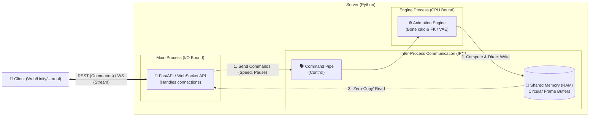
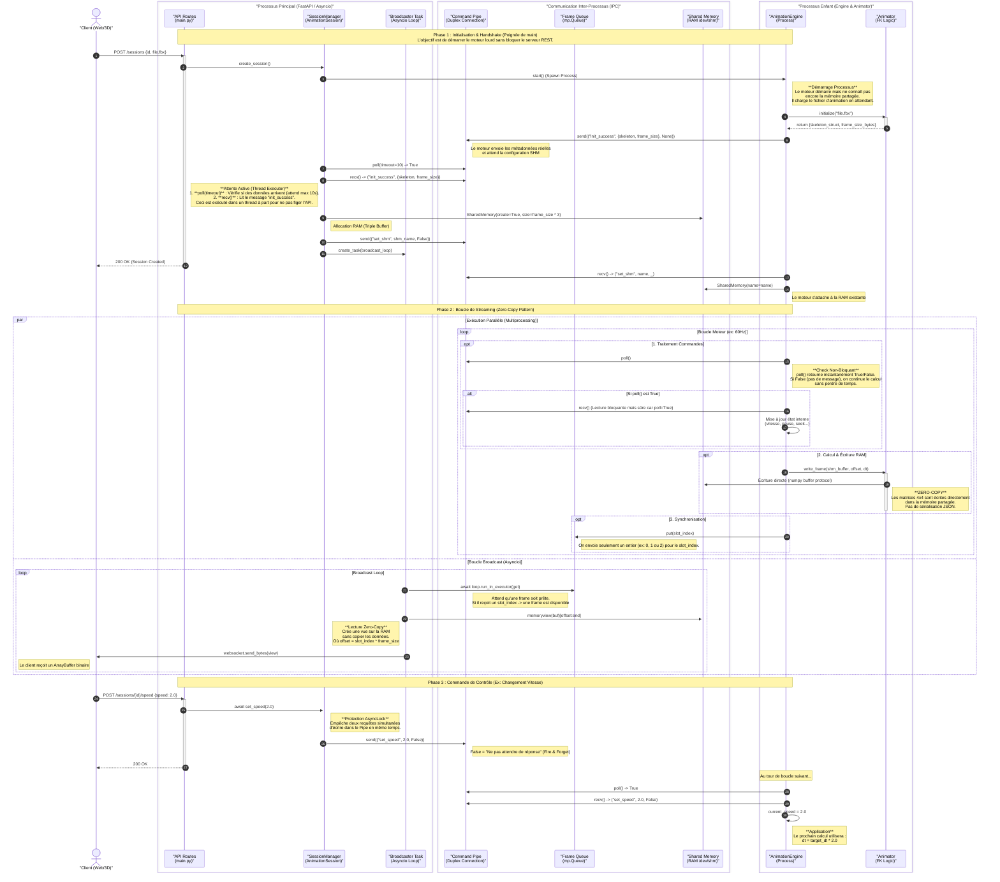

# MoMa_REST_Server
Multi-thread and multi-process real-time animation server with REST and WebSocket API
* Raw Binary streaming
* No data serialization
* Zero-Copy pattern with Shared Memory
* Async command handling

## Architecture Simplifiée

Cette architecture est conçue pour garantir des performances temps réel sans bloquer le serveur REST lors des calculs
lourds d'animation. Elle repose sur le modèle **Producer-Consumer** avec mémoire partagée.



### Note importante sur le streaming
La particularité avec ce serveur est que les données sont formatées en binaire (ArrayBuffer) pour minimiser la surcharge sur le CPU et sur le réseau. 

Il n'y a pas de sérialisation JSON, Protobuff ou XML.

Les données d'animation est envoyés sous la forme d'un tableau binaire de : **nb_bones x (4 x 4 matrices)**, tout ceci en **float32** pour chaque frame.

Le client doit être capable de lire ces données binaires et de les interpréter correctement (ex: WebGL, Unity NativeArray, etc.).

## Architecture Détailée



## 🛠️ Ajouter un nouvel Animator

Pour intégrer un nouveau type d'animation (ex: Inverse Kinematics, Motion Matching, etc.), vous devez implémenter l'interface `AnimatorInterface`.

### 1. Créer la classe Animator

Créez un nouveau fichier dans `src/animators/` (ex: `my_custom_animator.py`). Votre classe doit hériter de `AnimatorInterface` et implémenter les méthodes suivantes :

```python
from typing import Dict, Any
import numpy as np
from core.interfaces import AnimatorInterface

class MyCustomAnimator(AnimatorInterface):
    def __init__(self):
        # Initialisation basique (pas de chargement lourd ici)
        self.num_bones = 0
        self.bone_size_bytes = 4 * 4 * np.dtype(np.float32).itemsize # Matrice 4x4 float32

    def initialize(self, source_path: str):
        # 1. Charger le fichier source (FBX, BVH, etc.)
        # 2. Configurer le squelette
        # 3. Préparer les données d'animation
        # C'est ici que le chargement lourd (bloquant) doit se faire
        pass

    def get_skeleton(self) -> Dict[str, Any]:
        # Retourne la structure du squelette pour le client
        return {
            "type": "SKELETON_DEF",
            "bone_names": ["Hips", "Spine", ...],
            "parents": [-1, 0, ...], # Index des parents
            "bind_pose": {
                "positions": [...],
                "rotations": [...], # Quaternions ou Euler
                "scales": [...]
            }
        }

    def get_memory_size(self) -> int:
        # Taille précise nécessaire en octets pour une frame
        # Généralement : num_bones * 64 octets (matrice 4x4 float32)
        return self.num_bones * self.bone_size_bytes

    def write_frame_to_buffer(
        self, buffer_view: memoryview, offset: int, dt: float, playback_speed: float
    ):
        # Cœur du moteur : Calculer la pose actuelle et écrire directement dans la SHM
        
        # 1. Calculer l'animation (step) selon dt et playback_speed
        # ...
        
        # 2. Créer un tableau numpy pointant vers la mémoire partagée
        target_array = np.ndarray(
            shape=(self.num_bones, 4, 4),
            dtype=np.float32,
            buffer=buffer_view,
            offset=offset
        )
        
        # 3. Copier les matrices locales ou globales calculées (Zero-Copy)
        # np.copyto(target_array, calculated_matrices)
```
