# MoMa_REST_Server
Multi-thread and multi-process real-time animation server with REST and WebSocket API
* Raw Binary streaming
* No data serialization
* Zero-Copy pattern with Shared Memory
* Async command handling

## Architecture Simplifiée

Cette architecture est conçue pour garantir des performances temps réel sans bloquer le serveur REST lors des calculs
lourds d'animation. Elle repose sur le modèle **Producer-Consumer** avec mémoire partagée.

```mermaid
graph LR
    Client["👤 Client (Web/Unity/Unreal)"]

    subgraph Server ["Server (Python)"]
        subgraph MainProcess ["Main Process (I/O Bound)"]
            API["📡 FastAPI / WebSocket API<br>(Handles connections)"]
        end

        subgraph IPC ["Inter-Process Communication (IPC)"]
            SHM[("<br>💾 Shared Memory (RAM)<br>Circular Frame Buffers")]
            Pipe["🗣️ Command Pipe<br>(Control)"]
        end

        subgraph ChildProcess ["Engine Process (CPU Bound)"]
            Engine["⚙️ Animation Engine<br>(Bone calc & FK / VAE)"]
        end
    end

%% Data Flow
    Client <==>|" REST (Commands) / WS (Stream) "| API
    API -- " 1. Send Commands (Speed, Pause) " --> Pipe
    Pipe --> Engine
    Engine -- " 2. Compute & Direct Write " --> SHM
    SHM -.->|" 3. 'Zero-Copy' Read "| API
```



### Note importante sur le streaming
La particularité avec ce serveur est que les données sont formatées en binaire (ArrayBuffer) pour minimiser la surcharge sur le CPU et sur le réseau. 

Il n'y a pas de sérialisation JSON, Protobuff ou XML.

Les données d'animation est envoyés sous la forme d'un tableau binaire de : **nb_bones x (4 x 4 matrices)**, tout ceci en **float32** pour chaque frame.

Le client doit être capable de lire ces données binaires et de les interpréter correctement (ex: WebGL, Unity NativeArray, etc.).

## Architecture Détailée

```mermaid
sequenceDiagram
    autonumber
    actor Client as "Client (Web/3D)"

box "Processus Principal (FastAPI / Asyncio)"
participant API as "API Routes<br/>(main.py)"
participant Session as "SessionManager<br/>(AnimationSession)"
participant Broadcast as "Broadcaster Task<br/>(Asyncio Loop)"
end

box "Communication Inter-Processus (IPC)"
participant Pipe as "Command Pipe<br/>(Duplex Connection)"
participant Queue as "Frame Queue<br/>(mp.Queue)"
participant SHM as "Shared Memory<br/>(RAM /dev/shm)"
end

box "Processus Enfant (Engine & Animator)"
participant Engine as "AnimationEngine<br/>(Process)"
participant Animator as "Animator<br/>(FK Logic)"
end

%% == Phase 1 : Initialisation & Handshake ==
note over API, Engine: Phase 1 : Initialisation & Handshake (Poignée de main)<br/>L'objectif est de démarrer le moteur lourd sans bloquer le serveur REST.

Client->>API: POST /sessions {id, file.fbx}
activate API

API->>Session: create_session()
activate Session

Session->>Engine: start() (Spawn Process)
activate Engine

note right of Engine: **Démarrage Processus**<br/>Le moteur démarre mais ne connaît pas<br/>encore la mémoire partagée.<br/>Il charge le fichier d'animation en attendant.

Engine->>Animator: initialize("file.fbx")
activate Animator
Animator-->>Engine: return {skeleton_struct, frame_size_bytes}
deactivate Animator

Engine->>Pipe: send(("init_success", {skeleton, frame_size}, None))
note right of Pipe: Le moteur envoie les métadonnées réelles<br/>et attend la configuration SHM

Session->>Pipe: poll(timeout=10) -> True
Session->>Pipe: recv() -> ("init_success", {skeleton, frame_size})
note left of Session: **Attente Active (Thread Executor)**<br/>1. **poll(timeout)** : Vérifie si des données arrivent (attend max 10s).<br/>2. **recv()** : Lit le message "init_success".<br/>Ceci est exécuté dans un thread à part pour ne pas figer l'API.

Session->>SHM: SharedMemory(create=True, size=frame_size * 3)
activate SHM
note right of Session: Allocation RAM (Triple Buffer)

Session->>Pipe: send(("set_shm", shm_name, False))
Session->>Broadcast: create_task(broadcast_loop)
activate Broadcast

API-->>Client: 200 OK (Session Created)
deactivate API

Engine->>Pipe: recv() -> ("set_shm", name, _)
Engine->>SHM: SharedMemory(name=name)
note right of Engine: Le moteur s'attache à la RAM existante

%% == Phase 2 : Boucle de Streaming ==
note over API, Engine: Phase 2 : Boucle de Streaming (Zero-Copy Pattern)

par Exécution Parallèle (Multiprocessing)

loop Boucle Moteur (ex: 60Hz)
opt 1. Traitement Commandes
Engine->>Pipe: poll()
note right of Engine: **Check Non-Bloquant**<br/>poll() retourne instantanément True/False.<br/>Si False (pas de message), on continue le calcul<br/>sans perdre de temps.
alt Si poll() est True
Engine->>Pipe: recv() (Lecture bloquante mais sûre car poll=True)
Engine->>Engine: Mise à jour état interne<br/>(vitesse, pause, seek...)
end
end

opt 2. Calcul & Écriture RAM
Engine->>Animator: write_frame(shm_buffer, offset, dt)
activate Animator
Animator->>SHM: Écriture directe (numpy buffer protocol)
note right of Animator: **ZERO-COPY**<br/>Les matrices 4x4 sont écrites directement<br/>dans la mémoire partagée.<br/>Pas de sérialisation JSON.
deactivate Animator
end

opt 3. Synchronisation
Engine->>Queue: put(slot_index)
note right of Queue: On envoie seulement un entier (ex: 0, 1 ou 2) pour le slot_index.
end
end

and Boucle Broadcast (Asyncio)

loop Broadcast Loop
Broadcast->>Queue: await loop.run_in_executor(get)
note left of Queue: Attend qu'une frame soit prête.<br/>Si il reçoit un slot_index -> une frame est disponible

Broadcast->>SHM: memoryview(buf)[offset:end]
note left of Broadcast: **Lecture Zero-Copy**<br/>Crée une vue sur la RAM<br/>sans copier les données.<br/>Où offset = slot_index * frame_size

Broadcast->>Client: websocket.send_bytes(view)
note left of Client: Le client reçoit un ArrayBuffer binaire
end

end

%% == Phase 3 : Commande de Contrôle ==
note over API, Engine: Phase 3 : Commande de Contrôle (Ex: Changement Vitesse)

Client->>API: POST /sessions/{id}/speed {speed: 2.0}
activate API

API->>Session: await set_speed(2.0)

note right of Session: **Protection AsyncLock**<br/>Empêche deux requêtes simultanées<br/>d'écrire dans le Pipe en même temps.

Session->>Pipe: send(("set_speed", 2.0, False))
note right of Pipe: False = "Ne pas attendre de réponse" (Fire & Forget)

API-->>Client: 200 OK
deactivate API

note over Engine: Au tour de boucle suivant...
Engine->>Pipe: poll() -> True
Engine->>Pipe: recv() -> ("set_speed", 2.0, False)
Engine->>Engine: current_speed = 2.0

note right of Engine: **Application**<br/>Le prochain calcul utilisera :<br/>dt = target_dt * 2.0

```



## 🛠️ Ajouter un nouvel Animator

Pour intégrer un nouveau type d'animation (ex: Inverse Kinematics, Motion Matching, etc.), vous devez implémenter l'interface `AnimatorInterface`.

### 1. Créer la classe Animator

Créez un nouveau fichier dans `src/animators/` (ex: `my_custom_animator.py`). Votre classe doit hériter de `AnimatorInterface` et implémenter les méthodes suivantes :

```python
from typing import Dict, Any
import numpy as np
from core.interfaces import AnimatorInterface

class MyCustomAnimator(AnimatorInterface):
    def __init__(self):
        # Initialisation basique (pas de chargement lourd ici)
        self.num_bones = 0
        self.bone_size_bytes = 4 * 4 * np.dtype(np.float32).itemsize # Matrice 4x4 float32

    def initialize(self, source_path: str):
        # 1. Charger le fichier source (FBX, BVH, etc.)
        # 2. Configurer le squelette
        # 3. Préparer les données d'animation
        # C'est ici que le chargement lourd (bloquant) doit se faire
        pass

    def get_skeleton(self) -> Dict[str, Any]:
        # Retourne la structure du squelette pour le client
        return {
            "type": "SKELETON_DEF",
            "bone_names": ["Hips", "Spine", ...],
            "parents": [-1, 0, ...], # Index des parents
            "bind_pose": {
                "positions": [...],
                "rotations": [...], # Quaternions ou Euler
                "scales": [...]
            }
        }

    def get_memory_size(self) -> int:
        # Taille précise nécessaire en octets pour une frame
        # Généralement : num_bones * 64 octets (matrice 4x4 float32)
        return self.num_bones * self.bone_size_bytes

    def write_frame_to_buffer(
        self, buffer_view: memoryview, offset: int, dt: float, playback_speed: float
    ):
        # Cœur du moteur : Calculer la pose actuelle et écrire directement dans la SHM
        
        # 1. Calculer l'animation (step) selon dt et playback_speed
        # ...
        
        # 2. Créer un tableau numpy pointant vers la mémoire partagée
        target_array = np.ndarray(
            shape=(self.num_bones, 4, 4),
            dtype=np.float32,
            buffer=buffer_view,
            offset=offset
        )
        
        # 3. Copier les matrices locales ou globales calculées (Zero-Copy)
        # np.copyto(target_array, calculated_matrices)
```
